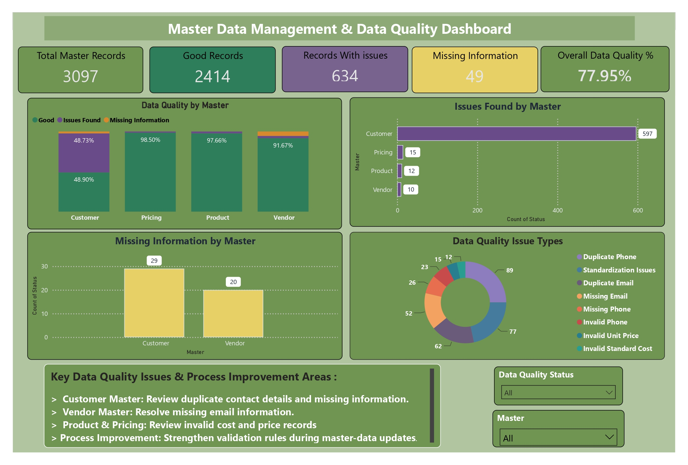

# Master Data Management & Data Quality Analysis

## 1. Project Overview

Master data is core information used across business processes and reporting. Examples include customer, product, vendor, and pricing information.

When master data contains missing values, duplicate information, invalid values, inconsistent formats, or incorrect attributes, it can affect reporting accuracy, operational processes, and downstream analysis.

This project focuses on analyzing and improving the quality of four master-data domains:

- Customer Master
- Product Master
- Vendor Master
- Pricing Master

The project demonstrates an end-to-end Master Data Management and Data Quality workflow using:

**Excel → Power Query → MySQL → Power BI → PowerPoint**

The objective was to profile the raw master data, identify data-quality problems, clean and standardize the data, apply validation rules, independently verify selected issues using SQL, and present the final results through an interactive Power BI dashboard.

---

# 2. Problem Statement

Organizations depend on accurate and consistent master data for day-to-day operations, reporting, analytics, and decision-making.

However, master data can become inconsistent when information is entered or maintained without sufficient validation controls.

Typical examples include:

- Customer records with missing email or phone information
- Duplicate customer contact details
- Invalid phone numbers
- Product records with invalid standard costs
- Inconsistent product categories or names
- Vendor records with missing contact information
- Duplicate vendor contact details
- Pricing records with invalid unit prices
- Incorrect or inconsistent master-data formats
- Invalid identifiers
- Date-related data-quality problems

These issues can reduce data reliability and make downstream reporting and analysis less dependable.

### Project Problem

The project was designed to answer the following question:

> **How can the quality of Customer, Product, Vendor, and Pricing master data be systematically analyzed, validated, reported, and improved using practical data-analysis tools?**

The project therefore focused on building a structured process to:

1. Understand the raw master data.
2. Profile the data and identify quality issues.
3. Clean and standardize applicable fields.
4. Apply business and structural validation rules.
5. Classify records according to their quality status.
6. Independently verify selected issues using SQL.
7. Create consolidated data-quality reports.
8. Build a Power BI dashboard for monitoring and analysis.
9. Identify process-improvement areas based on the findings.

---

# 3. Project Objective

The primary objective was to create a practical data-quality analysis framework for master data.

### Specific Objectives

- Analyze Customer, Product, Vendor, and Pricing master data.
- Identify missing values and duplicate information.
- Identify invalid values and standardization issues.
- Clean and standardize the applicable master-data fields.
- Validate master-data identifiers and business attributes.
- Apply validation rules based on the structure of each master.
- Classify records as Good, Issues Found, or Missing Information.
- Perform independent database-level quality checks using MySQL.
- Build an Excel-based data-quality report.
- Build an interactive Power BI dashboard.
- Identify important data-quality issues and process-improvement areas.
- Document the complete analysis for reproducibility and presentation.

---

# 4. Project Scope

The project covered four master-data domains.

| Master | Purpose |
|---|---|
| Customer Master | Customer and contact information |
| Product Master | Product and product-attribute information |
| Vendor Master | Supplier/vendor information |
| Pricing Master | Product/vendor pricing information |

The analysis covered:

- Data profiling
- Data cleaning
- Data standardization
- Data validation
- Duplicate analysis
- Missing-value analysis
- Business-rule validation
- SQL data-quality checks
- Quality reporting
- Power BI visualization
- Process-improvement analysis

---

# 5. Data Volume

The project contained **3,097 master-data records** across four domains.

| Master Data | Records |
|---|---:|
| Customer | 1,225 |
| Product | 512 |
| Vendor | 360 |
| Pricing | 1,000 |
| **Total** | **3,097** |

The raw data was maintained separately from the cleaned and validated data so that the original records could be compared against the prepared data.

---

# 6. Technology Stack

| Tool | Purpose |
|---|---|
| Microsoft Excel | Data profiling, analysis and quality reporting |
| Power Query | Data cleaning, transformation and validation |
| MySQL / MySQL Workbench | Independent database-level data-quality checks |
| Power BI | Dashboard, KPI reporting and visualization |
| Microsoft PowerPoint | Project presentation and documentation |
| GitHub | Project version control and portfolio presentation |

---

# 7. End-to-End Project Workflow

The complete workflow followed this process:

``` text
Raw Master Data
       ↓
Data Profiling
       ↓
Data Cleaning
       ↓
Data Standardization
       ↓
Data Validation
       ↓
Data Quality Classification
       ↓
SQL Data Quality Verification
       ↓
Excel Quality Reporting
       ↓
Power BI Dashboard
       ↓
Findings & Process Improvement 
```
# 8. Raw Data Profiling

The first step was to understand the quality and structure of the raw master data before making any changes.

The profiling process looked for:

- Missing values
- Duplicate records
- Duplicate contact information
- Invalid values
- Invalid identifiers
- Standardization issues
- Invalid costs and prices
- Inconsistent categories
- Inconsistent statuses
- Date-related issues

The purpose of profiling was to understand **what was wrong with the data before cleaning it**.

This distinction was important because the raw data was retained as the reference point for the analysis.

---

# 9. Customer Master Analysis

## 9.1 Customer Master Structure

The Customer Master contained:

- `Customer_ID`
- `Customer_Name`
- `Email`
- `Phone`
- `City`
- `State`
- `Country`
- `Customer_Type`
- `Status`
- `Created_Date`

**Total records: 1,225**

---

## 9.2 Customer Data Profiling

The following issues were identified during profiling:

| Data Quality Check | Result |
|---|---:|
| Total Records | 1,225 |
| Missing Email | 32 |
| Missing Phone | 26 |
| Duplicate Emails | 46 |
| Duplicate Phones | 59 |
| Invalid Phone | 13 |
| Name Standardization Issues | 36 |
| Duplicate Customer IDs | 0 |
| Future Created Dates | 590 |

---

## 9.3 Customer Data Cleaning

Power Query was used to:

- Remove exact duplicate rows.
- Trim unnecessary spaces.
- Clean text values.
- Standardize applicable customer-type values.
- Standardize status values.
- Convert fields to appropriate data types.
- Convert `Created_Date` into a proper date field.
- Retain missing information where business follow-up was required.

Missing values were not filled with invented information.

---

## 9.4 Customer Validation

Validation checks included:

- Customer ID format
- Email format
- Phone number format
- Customer name
- Customer type
- Status
- Created date
- Future-date validation

The validation process classified records into:

- **Good**
- **Issues Found**
- **Missing Information**

---

# 10. Product Master Analysis

## 10.1 Product Master Structure

The Product Master contained:

- `Product_ID`
- `Product_Name`
- `Category`
- `Brand`
- `Unit_of_Measure`
- `Status`
- `Standard_Cost`

**Total records: 512**
## 10.2 Product Data Profiling

| Data Quality Check | Result |
|---|---:|
| Total Records | 512 |
| Missing Values | 0 |
| Duplicate Product IDs | 0 |
| Duplicate Product Names | 24 |
| Invalid Standard Cost | 12 |
| Product Name Standardization Issues | 21 |
| Invalid Product IDs | 0 |

## 10.3 Product Data Cleaning

Power Query was used to:

- Remove exact duplicate rows.
- Trim and clean product names.
- Standardize applicable categories.
- Clean brand values.
- Standardize units of measure.
- Standardize status values.
- Convert `Standard_Cost` to the correct numeric data type.

## 10.4 Product Validation

Validation checks included:

- Product ID format.
- Product name.
- Approved category values.
- Unit of measure.
- Active/Inactive status.
- Standard cost greater than zero.

A negative or zero standard cost was treated as invalid for the project validation rule.

---

# 11. Vendor Master Analysis

## 11.1 Vendor Master Structure

The Vendor Master contained:

- `Vendor_ID`
- `Vendor_Name`
- `Email`
- `Phone`
- `City`
- `State`
- `Country`
- `Vendor_Type`
- `Status`

**Total records: 360**

## 11.2 Vendor Data Profiling

| Data Quality Check | Result |
|---|---:|
| Total Records | 360 |
| Duplicate Vendor IDs | 0 |
| Missing Email | 20 |
| Duplicate Emails | 16 |
| Duplicate Phones | 30 |
| Invalid Email Format | 0 |
| Invalid Phone | 10 |
| Name Standardization Issues | 20 |
| Invalid Vendor IDs | 0 |

## 11.3 Vendor Data Cleaning

Power Query was used to:

- Remove exact duplicate rows.
- Retain missing email information for follow-up.
- Trim and clean text fields.
- Standardize vendor types.
- Standardize status values.
- Maintain phone values as text.
- Apply appropriate data types.

## 11.4 Vendor Validation

Validation checks included:

- Vendor ID format.
- Email format.
- Phone number format.
- Vendor type.
- Active/Inactive status.
- Vendor name.

---

# 12. Pricing Master Analysis

## 12.1 Pricing Master Structure

The Pricing Master contained:

- `Price_ID`
- `Product_ID`
- `Vendor_ID`
- `Currency`
- `Unit_Price`
- `Effective_From`
- `Effective_To`
- `Price_Status`

**Total records: 1,000**

## 12.2 Pricing Data Profiling

| Data Quality Check | Result |
|---|---:|
| Total Records | 1,000 |
| Duplicate Price IDs | 0 |
| Duplicate Product IDs | 857 |
| Duplicate Vendor IDs | 943 |
| Invalid Unit Price | 15 |
| Invalid Product IDs | 0 |
| Invalid Vendor IDs | 0 |
| Currency | INR |
| Invalid Date Ranges | 0 |

## 12.3 Pricing Duplicate Analysis

Duplicate `Product_ID` and `Vendor_ID` values were not automatically classified as errors.

The reason is that a product can have multiple pricing records and a vendor can have multiple pricing records.

For example:

```text
Product P1001
    ↓
Vendor V1001 → Price Record 1
Vendor V1002 → Price Record 2
Vendor V1003 → Price Record 3
```

Therefore:

> Duplicate `Product_ID` or `Vendor_ID` in the Pricing Master does not automatically indicate duplicate records.

Exact duplicate rows were treated separately.

## 12.4 Pricing Data Cleaning

Power Query was used to:

- Remove exact duplicate rows.
- Check null values.
- Clean `Price_ID`, `Product_ID` and `Vendor_ID`.
- Clean and standardize currency.
- Standardize `Price_Status`.
- Apply appropriate data types.
- Maintain open-ended `Effective_To` values where applicable.

---

## 12.5 Pricing Validation

Validation checks included:

- Price ID format.
- Product ID format.
- Vendor ID format.
- Unit price greater than zero.
- Currency.
- Price status.
- Effective date logic.

Invalid unit-price records were identified through validation.

---

# 13. Data Validation Framework

After cleaning, validation rules were applied to check whether records followed the expected structure and business rules.

The validation framework covered:

### Identifier Validation

Examples:

```text
Customer ID → C + 4 digits
Product ID  → P + 4 digits
Vendor ID   → V + 4 digits
Price ID    → PR + 4 digits
```
### Contact Validation

- Email format.
- Phone number format.

### Business Attribute Validation

- Approved categories.
- Approved customer/vendor types.
- Approved status values.
- Approved unit-of-measure values.
- Currency.

### Numeric Validation

- Standard cost greater than zero.
- Unit price greater than zero.

### Date Validation

- Created date should not be in the future.
- `Effective_From` should follow the expected date logic.
- `Effective_To` should not be earlier than `Effective_From`.
- Open-ended `Effective_To` values were allowed.

# 14. Overall Data Quality Classification

Each record was classified into one of three categories:

### Good

The record passed the applicable validation checks and did not contain the defined quality issues.

### Issues Found

The record contained one or more invalid values or validation issues.

### Missing Information

The record contained missing information requiring follow-up.

This classification was then used for the Excel reports and Power BI dashboard.

---

# 15. Final Data Quality Results

The final results were:

| Master | Good | Issues Found | Missing Information |
|---|---:|---:|---:|
| Customer | 599 | 597 | 29 |
| Product | 500 | 12 | 0 |
| Vendor | 330 | 10 | 20 |
| Pricing | 985 | 15 | 0 |
| **Total** | **2,414** | **634** | **49** |

---

# 16. Overall Data Quality

The project calculated the overall proportion of records classified as Good.

```text
Good Records         = 2,414
Total Records        = 3,097
Overall Data Quality = 77.95%
```
Therefore:

**Overall Data Quality = 77.95%**

The remaining records were classified as either:

- Issues Found
- Missing Information

### Important Note

Individual issue-type counts can overlap across the same record.

Therefore, issue-type counts should **not** be added together to calculate the total number of affected records.
## 17. Excel Data Quality Reporting

Excel was used as one of the primary analysis and reporting tools.

The Excel workflow included:

- Data profiling
- Data cleaning
- Data standardization
- Validation
- Quality classification
- Quality summaries
- Domain-level reporting

The workbook maintained separate raw and cleaned master-data sheets so that the transformation process could be reviewed.

### Excel Reporting Output

The final quality reports provided a consolidated view of:

- Total records
- Good records
- Records with issues
- Missing information
- Master-level quality results
- Key issue categories

## 18. Power Query Transformation

Power Query was used as the main transformation layer.

The general Power Query process was:
```text
Raw Data
   ↓
Load Data
   ↓
Profile Columns
   ↓
Remove Exact Duplicates
   ↓
Clean Text
   ↓
Standardize Values
   ↓
Set Data Types
   ↓
Create Validation Columns
   ↓
Create Overall Status
   ↓
Load Prepared Data
```

Power Query was especially useful because the cleaning and validation steps could be repeated consistently instead of manually changing individual cells.

## 19. SQL Data Quality Verification

MySQL was used as an independent verification layer.

The purpose of SQL was not to replace the Excel/Power Query workflow.

Instead, SQL was used to independently check selected quality conditions directly against the raw database tables.

The database contained:

- Customer_Master
- Product_Master
- Vendor_Master
- Pricing_Master

### SQL Checks Performed

**Customer Master**
- Missing Email
- Missing Phone

**Product Master**
- Invalid Standard Cost

**Vendor Master**
- Missing Email
- Missing Phone

**Pricing Master**
- Invalid Unit Price

### SQL Verification Results

| Master | Check | Result |
|---|---|---|
| Customer | Missing Email | 32 |
| Customer | Missing Phone | 26 |
| Product | Invalid Standard Cost | 12 |
| Vendor | Missing Email | 20 |
| Vendor | Missing Phone | 0 |
| Pricing | Invalid Unit Price | 15 |

These checks provided an independent database-level verification of selected data-quality findings.
## 21. Power BI Data Model

The prepared data was loaded into Power BI for reporting.

The model contained:

**Cleaned Master Tables**
- Customer_Master_Cleaned
- Product_Master_Cleaned
- Vendor_Master_Cleaned
- Pricing_Master_Cleaned

**Validation Tables**
- Customer_Data_Validation
- Product_Data_Validation
- Vendor_Data_Validation
- Pricing_Data_Validation

## 22. Power BI Relationships

Relationships were created between related master tables and their validation tables.

**Product and Pricing**

```text
Product_Master_Cleaned
|
| Product_ID
↓
Pricing_Master_Cleaned
```

Relationship: `1 : *`

**Vendor and Pricing**
```text
Vendor_Master_Cleaned
|
| Vendor_ID
↓
Pricing_Master_Cleaned
```

Relationship: `1 : *`

Since a product or vendor can have multiple pricing records, one-to-many relationships were used.

The cleaned master tables were also connected to their corresponding validation tables using the appropriate master-data keys.

## 23. Power BI DAX Measures

The dashboard used DAX measures for the main quality KPIs.

**Total Master Records**

```dax
Total Master Records =
COUNTROWS(Master_Quality_Summary)
```

Result: **3,097**

**Good Records**

```dax
Good Records =
CALCULATE(
    COUNTROWS(Master_Quality_Summary),
    Master_Quality_Summary[Status] = "Good"
)
```

Result: **2,414**

**Records with Issues**

```dax
Records with Issues =
CALCULATE(
    COUNTROWS(Master_Quality_Summary),
    Master_Quality_Summary[Status] = "Issues Found"
)
```

Result: **634**

**Missing Information**

```dax
Missing Information =
CALCULATE(
    COUNTROWS(Master_Quality_Summary),
    Master_Quality_Summary[Status] = "Missing Information"
)
```

Result: **49**

**Overall Data Quality %**

```dax
Overall Data Quality % =
DIVIDE(
    [Good Records],
    [Total Master Records],
    0
)
```

Result: **77.95%**


## 24. Power BI Dashboard

An interactive Power BI dashboard was created to provide a consolidated view of master-data quality.



The dashboard contains:

- 5 KPI cards
- 4 charts
- 2 slicers
- Master-level quality analysis
- Issue analysis
- Missing-information analysis
- Issue-type analysis

### KPI Cards

The five KPI cards show:

1. Total Master Records
2. Good Records
3. Records with Issues
4. Missing Information
5. Overall Data Quality %

### Dashboard Visualizations

**Data Quality by Master**
A 100% stacked column chart showing the quality distribution across:
- Customer
- Product
- Vendor
- Pricing

**Issues Found by Master**
A chart showing the number of records classified as *Issues Found* for each master.

**Missing Information by Master**
A chart showing records classified as *Missing Information*.

**Data Quality Issue Types**
A donut chart showing the distribution of identified issue types.

### Dashboard Filters

Two slicers were included:
- Master
- Status

These allow users to filter the dashboard interactively.

## 26. Key Findings

The analysis identified the following major data-quality areas.

### Customer Master

The Customer Master had issues related to:

- Missing email information
- Missing phone information
- Duplicate email values
- Duplicate phone values
- Invalid phone values
- Name standardization
- Future created dates

The final classification was:
| Status | Count |
|---|---|
| Good | 599 |
| Issues Found | 597 |
| Missing Information | 29 |


### Product Master

The Product Master had issues related mainly to:

- Invalid standard costs
- Product-name standardization
- Potential duplicate product names

The final classification was:
| Status | Count |
|---|---|
| Good | 500 |
| Issues Found | 12 |
| Missing Information | 0 |


### Vendor Master

The Vendor Master had issues related to:

- Missing email information
- Duplicate emails
- Duplicate phones
- Invalid phone values
- Vendor-name standardization

The final classification was:
| Status | Count |
|---|---|
| Good | 330 |
| Issues Found | 10 |
| Missing Information | 20 |


### Pricing Master

The Pricing Master mainly contained:

- Invalid unit-price records

Duplicate Product_ID and Vendor_ID values were not automatically treated as errors because multiple pricing records can legitimately exist for the same product or vendor.

The final classification was:
| Status | Count |
|---|---|
| Good | 985 |
| Issues Found | 15 |
| Missing Information | 0 |


## 27. Process Improvement Recommendations

Based on the data-quality findings, the following process improvements were identified.

**1. Strengthen Mandatory-Field Validation**
Important fields such as customer and vendor email information can be validated before records are accepted.

**2. Strengthen Duplicate Detection**
Duplicate contact information should be monitored using appropriate matching logic rather than relying only on exact record duplication.

**3. Apply Standardized Values**
Controlled values should be maintained for fields such as:
- Category
- Status
- Customer Type
- Vendor Type
- Unit of Measure
- Currency

**4. Validate Identifier Formats**
Master-data IDs should follow consistent formats before records are loaded into downstream systems.

**5. Validate Cost and Price Values**
Business rules should prevent invalid or non-positive cost and price values from entering the master data.

**6. Strengthen Date Validation**
Date fields should be checked for future dates and invalid date relationships.

**7. Monitor Data Quality Periodically**
A recurring data-quality review can help identify repeated problems and monitor improvements over time.

**8. Use Data Quality Reporting**
A dashboard can provide a consolidated view of quality issues and help users focus on areas requiring attention.

## 28. Project Outcome

The project produced an end-to-end framework for analyzing master-data quality across four domains.

The final solution combined:
``` text
Excel
↓
Data Profiling & Reporting

Power Query
↓
Cleaning, Standardization & Validation

MySQL
↓
Independent Data Quality Verification

Power BI
↓
Interactive Quality Dashboard

PowerPoint
↓
Project Presentation & Communication
```

The analysis identified 3,097 master records, of which:

- 2,414 records were classified as **Good**
- 634 records were classified as **Issues Found**
- 49 records were classified as **Missing Information**
- **77.95%** of the records were classified as **Good**

The project also identified specific areas where stronger validation and master-data maintenance processes could help improve data quality.

## 28. Repository Structure

master-data-management-data-quality-analysis/
│
├── data/
│   ├── customer_master_raw.csv
│   ├── product_master_raw.csv
│   ├── vendor_master_raw.csv
│   └── pricing_master_raw.csv
│
├── documentation/
│   └── project documentation files
│
├── excel/
│   ├── Master_Data_Management_Data_Quality.xlsx
│   └── Master_Data_Validation.xlsx
│
├── powerbi/
│   └── MDM_Data_Quality_Analysis.pbix
│
├── screenshots/
│   ├── powerbi_dashboard.png
│   ├── customer_master_sql_quality_checks.png
│   ├── product_master_sql_quality_checks.png
│   ├── vendor_master_sql_quality_checks.png
│   ├── pricing_master_sql_quality_checks.png
│   └── final_sql_data_quality_summary.png
│
└── sql/
    └── data_quality_checks.sql 

## 31. Skills Demonstrated

This project demonstrates practical experience with:

### Master Data Management
- Customer Master
- Product Master
- Vendor Master
- Pricing Master
- Master-data structure
- Data maintenance concepts
- Data-quality analysis

### Data Quality
- Data profiling
- Missing-value analysis
- Duplicate analysis
- Data cleaning
- Data standardization
- Data validation
- Business-rule validation
- Data accuracy checks

### Microsoft Excel
- Data analysis
- Data-quality reporting
- PivotTables
- Charts
- Conditional analysis
- Data validation
- Reporting

### Power Query
- Data transformation
- Duplicate removal
- Text cleaning
- Standardization
- Data-type transformation
- Validation columns

### SQL
- MySQL
- Database creation
- Data-quality checks
- Missing-value checks
- Invalid-value checks
- Independent verification

### Power BI
- Data modeling
- Relationships
- DAX measures
- KPI reporting
- Slicers
- Cross-filtering
- Data visualization
- Dashboard development

### Business Analysis
- Issue identification
- Data interpretation
- Reporting
- Process-improvement analysis
- Documentation
- Presentation of findings

## Conclusion

This project demonstrates an end-to-end approach to Master Data Management and Data Quality Analysis.

Starting from raw Customer, Product, Vendor, and Pricing master data, the project followed a structured process of:
Profiling → Cleaning → Standardization → Validation → SQL Verification → Reporting → Visualization → Process Improvement


The final Power BI dashboard provides a consolidated view of master-data quality, while the Excel, Power Query, and SQL work provide supporting evidence for the analysis.

The project demonstrates how practical data-analysis techniques can be applied to identify master-data quality problems, validate records, communicate findings, and identify opportunities for improving data-maintenance processes.
